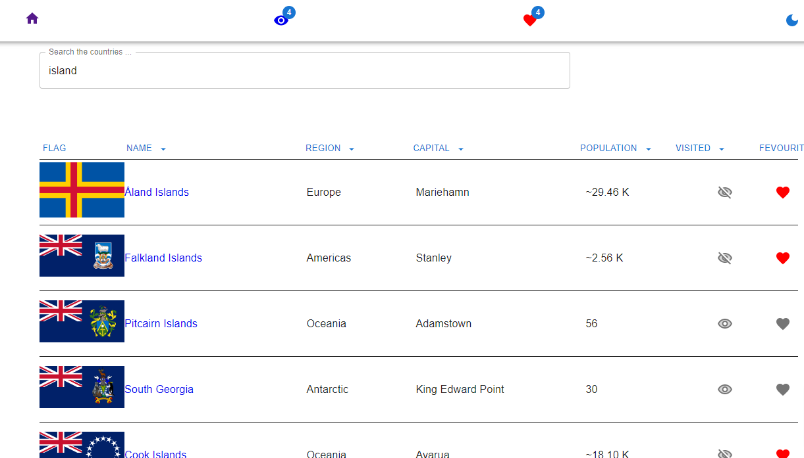

# Countries Project

This project is a template from a private repo solution to the following [requirements](./requirements.md)

## Description

Fullstack platform built with Reactjs & Reduxtoolkit. This app includes profiles, authentication, places, reviews, and many more features. Users can view places on the map, log in with google, and login user can review, deleted, and update their own reviews.

## Features

- Display all the countries
- Sort Countries by name, region, the capital city, population, visited, favorite
- Toggle and persist countries as visited or favorite
- Toggle dark mode and persist
- The country details page
- Search Country By name or capital city
- Favorite and visited countries pages

<br>

<p align="center">

</p>

## Live demo

A [live demo](https://limo-frontend-project.netlify.app) of the app is hosted on Netlify.

## Technology stack

> ### FrontEnd
>
> - React
> - TypeScript
> - React Hooks
> - React router
> - Redux Toolkit
> - Mui
> - Netlify hosting
>   <br>

## Usage

Clone this repository to the desired location

```Shell
git clone https://github.com/v-limo/frontend_project.git
```

### Install Dependencies

```
npm install

```

### Run

```
# Run frontend (:3000)
npm run start
```

## Build & Deploy

```
# Create  prod build
cd frontend
npm run build
```

### Contributing

Contributions are highly appreciated. In general, I follow the "fork-and-pull" Git workflow.

1. **Fork** this repo
2. **Clone** the project to your own machine
3. **Commit** changes to your own branch
4. **Push** your work back up to your fork
5. **Submit** a Pull request so that I can review your changes

**NOTE:** Be sure to merge the latest from "upstream" before making a pull request!

### License

MIT license
